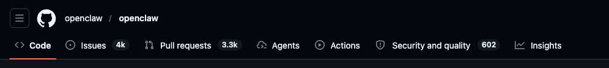
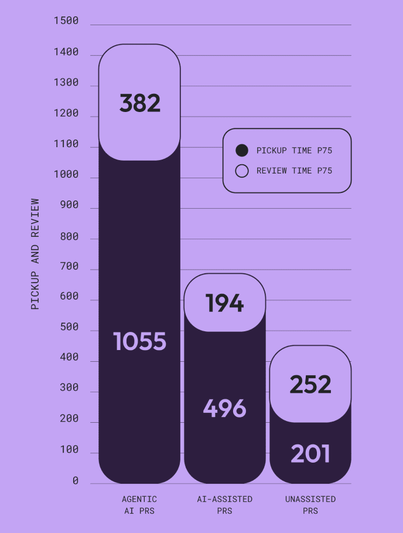
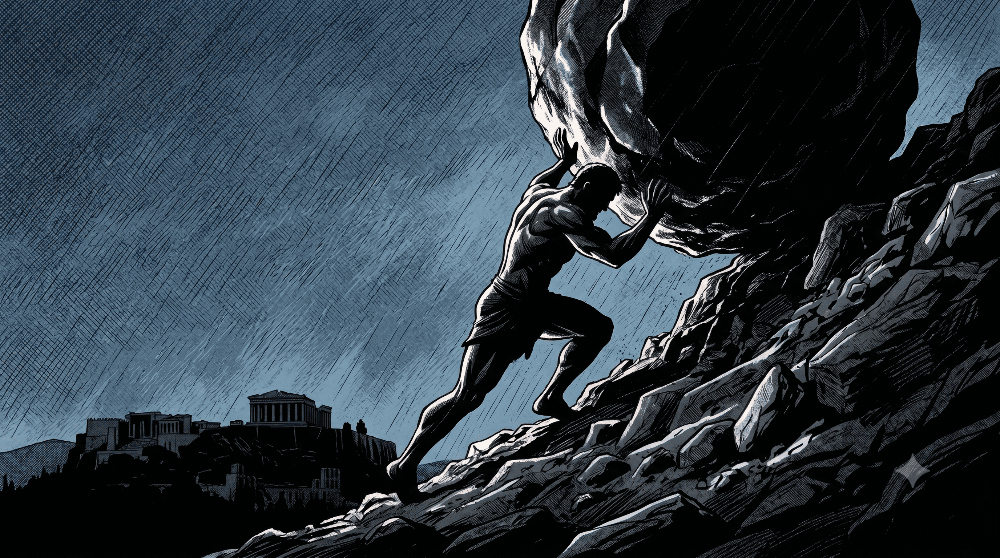

With the rise of AI-assisted development, the influx of pull requests per day is real. Development is considerably cheaper, and the costlier, more time-consuming aspect of the job is now the review. Developers have always been the bottleneck because traditionally creation was usually the more expensive part. Writing code was slower than reviewing code, and this is what development teams accounted for when they estimated a story.

*Not sure if the number of issues is directly proportional to number of AI-assisted / Agentic PRs*

AI-assisted developers and AI agents now churn out much more than the traditional norm. You can see signs of this in OSS projects, where OpenClaw right now has north of 3,000 pull requests open. [Tldraw changed their contribution policy](https://tldraw.dev/blog/stay-away-from-my-trash), due to an influx of low-quality AI pull requests, automatically closing pull requests from external contributors.

## Trying an old trick

Sometime back I was tasked with reviewing features coming in from a project team into Bahmni. Little did I know that this was a project that was well in development for over a year and had a huge backlog of PRs that they never raised. One by one the PRs started flooding in. Most of the original contributors had moved on and there was very little context that I had on the changes raised.

What I realized was that if I started my day with the bigger PRs, I could skim through them, call out the obvious and ask for immediate code changes while I got more time to work on the smaller PRs in detail. This kept me sane and helped me throttle the inflow.

But this was before our teams adopted AI-assisted development. These days there is little that I can do to throttle the inflow, as code changes are much faster. Churning out more features, fixing bugs and making code changes have all become significantly easier, which meant the bottleneck has now shifted towards the next most difficult task, which is to sit down and review code. I ask for a code change and before I reach out to the contributor to discuss the changes requested, the AI agent has already raised a new PR that addresses my comments.

## Developers stuck in purgatory

A feature built with AI assistance in ~10 minutes and ~200-300 lines of code changes takes, in my view, at least twice as long for a fellow developer to review. Now this leads to 2 scenarios:

- The contributor who raised the PR moves on to a new task and eventually raises another PR
- Or stays waiting, essentially wasting that time they gained in faster code generation.

In the first scenario when the reviewer comes back with a code change request, the developer now has to switch context, get back to what this original PR was doing and accommodate the suggested change.

While in the latter, the amount of time that the developer or the team collectively saved in development is thrown away waiting for the review. The fallacy of the increased AI productivity is questioned, for software development is not just development but a variety of things that still needs human oversight, resulting in human limitation.

*Acceptance Rates for AI-generated PRs are significantly lower than manual PRs (32.7% vs. 84.4%).*

This is true for both small and large teams, working on brownfield and greenfield projects. According to the [2026 Software Engineering Benchmarks Report by LinearB](https://linearb.io/resources/software-engineering-benchmarks-report), AI-generated Pull Requests (PRs) wait 4.6x longer in review queues compared to human-written code. This isn't just about the influx — it could partly be because of the inherent lack of trust developers have in AI-generated PRs, deeming them to require heavier scrutiny.

For an OSS project this is trickier, for by the time you get to a PR, your contributor might have already lost interest and moved on, leaving you with an "orphan" PR.

## One must imagine Sisyphus happy

*A man condemned not to death but to repetition*

Reviewing code, refactoring, and adding test cases are things that developers usually deem less rewarding. Especially code reviews. Code reviews require a lot of context, and directly or indirectly you are responsible for whatever is being merged to the mainline. This is not the enjoyable part of software engineering, but is nonetheless an important one. The effort put into code review is never accounted for anywhere, and in most cases code review is an additional responsibility that you sign up for along with whatever you already have on your plate.

Now with the influx of PRs, human reviewers also fall into 2 major traps:

- You spend all your effort in a PR review, while more and more keep piling up
- Or you stop paying attention and just click “Approve” or say “lgtm”.

Reviews, just like development, can be automated. There are tools like [CodeRabbit](https://www.coderabbit.ai/) that can scan the PR and raise issues as comments. They are great at finding bugs and helps reduce the time you spend scanning boilerplate should shrink.

But how do I trust code that was written and reviewed by AI? My humble brain hasn't been able to find peace with this idea. I am sure AI reviewers would do a better job at catching bugs and enforcing standards, but it often does not think about design. A poorly designed feature would pass a review and would go to production if AI reviews its own code without any human oversight. Add to that is the fact that if you've seen great success with some of the earlier AI code review, you will start trusting it more; eventually rubber-stamping a "lgtm" across anything that passes an AI review.

## Confusing times

Ever since late 2022, with the rise of AI, it is widely accepted across the industry that the times have changed. What was once the bottleneck has now become the easiest with tools like [Replit](https://replit.com/) generating live prototypes and production-ready codebases in minutes. But for the skeptic in me, this has not removed the bottleneck but moved it further downstream.

Yet this problem is not new and is not unique to software development. During the initial rollout of the COVID-19 vaccines, public health departments faced severe logistical hurdles that violently shifted across the supply chain. While early bottleneck issues regarding manufacturing and cold-chain storage were quickly resolved by pharmaceutical scaling, the systemic pressure immediately crashed downward onto local administration and registration software, where malfunctioning appointment websites and a shortage of trained nursing staff left millions of doses frozen in storage [while citizens struggled to secure a shot](https://www.reuters.com/world/uk/long-queues-form-vaccine-centre-central-london-reuters-photographer-2021-12-14/).

Code review helped me understand what others were doing, what was new, and taught me different approaches and perspectives on software development. With the influx, it's hard to catch up and much more difficult to learn. When a Pull Request is opened that may be suboptimal, I am influenced by the selected solution and find it harder to suggest alternative approaches.

As a developer, when I push code, I take responsibility for the changes, and as a reviewer, I am accountable for the PR that I approve. I cannot hold AI responsible for the changes it suggested, and until the day comes when it can, developers like me will always be the bottleneck.
