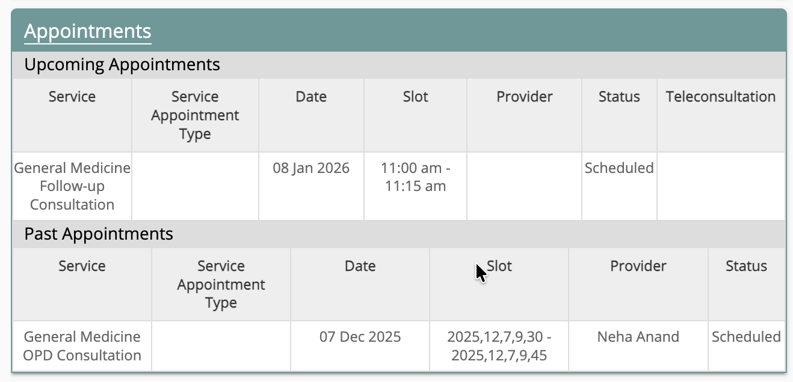
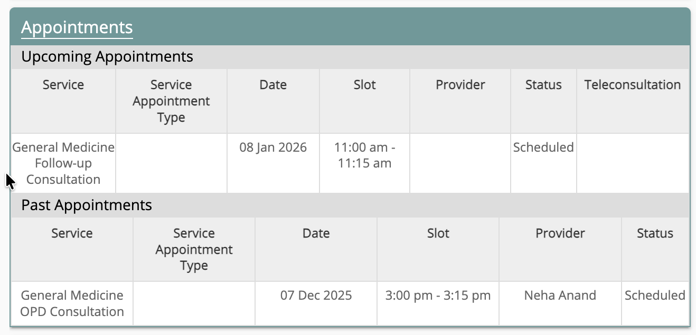

*Broken appointment display showing date-time values rendered as arrays*

While we were having a desk check, I noticed that the appointment display control on our AngularJS based Bahmni Frontend was broken with the start and end date-time values being rendered as arrays and were offset by 5:30 hours behind the expected client-converted time string. I remember fixing this issue, as this was one of the very first cards that I had played in Bahmni when I joined the team as a grad a couple of years ago.

*Fixed appointment display showing correct date-time strings*

My immediate thought was that the TZ variable was not set properly which might have been causing all this trouble. I played around with it for a while and nothing seemed to happen. My next guess was that someone had tampered with the perfect solution I added and messed things up. I fumed with anger and went to the [customControl.js](https://github.com/Bahmni/standard-config/blob/master/openmrs/apps/customDisplayControl/js/customControl.js) to figure out whose neck I should break. But to my surprise, no one had touched it either.

Now going through the code I realized what the issue was. My "perfect" solution worked for date because I accounted for the months to be zero indexed but didn't fix the same for dateTime. For the past few years every December the display control would break, because it had no idea how to deal with the 12th month because december for it was 11 (zero indexed).

With a sincere apology, I raised a PR fixing the same for both:

- [clinical-config](https://github.com/Bahmni/clinic-config/pull/246)
- [standard-config](https://github.com/Bahmni/standard-config/pull/74)

Quite a humbling experience and a reminder that not everything that we write is perfect. We do the best we can with the knowledge we have, occasionally making mistakes that will humble us later.
